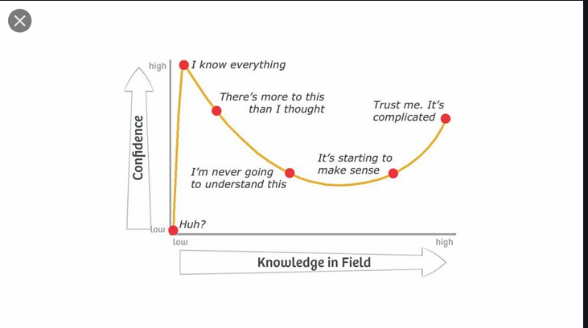
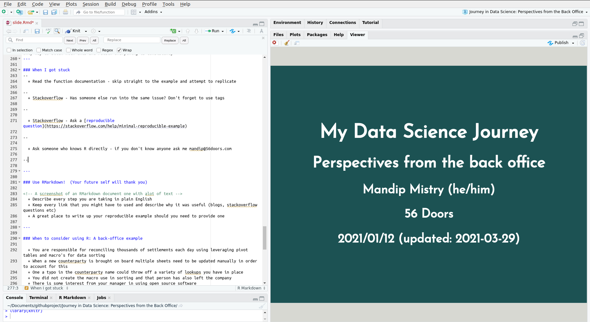

```{r xaringan-themer, include=FALSE, warning=FALSE}
library(xaringanthemer)
library(knitr)
style_mono_accent(
  base_color = "#1c5253",
  header_font_google = google_font("Josefin Sans"),
  text_font_google   = google_font("Montserrat", "300", "300i"),
  code_font_google   = google_font("Fira Mono")
)
```      


### A little about me 

--

 - Business Analyst Risk and Analytics

--

 - Living and working in Toronto
 
--

 - Avid cyclist and occasional handyman

???

 - Working at HOOPP where we deliver on the Pension Promise for 300K plus health care workers in Ontario
 - I live and work in beautiful Toronto Ontario. 
 - When I am not working I can be caught cycling the trails in the neighborhood or building something new from pine wood. 

---

### What I will talk about

--

   + My framework for learning and applying R to my day to day tasks
--

   + Recognize when it makes sense to switch an Excel process to R 
--

   + How to convince a team-mate to join the jouRney with you 

???

+ Today I will focus on three topics 

Read First Point: This was important as it kept me focused when climbing that steep learning curve

Not every Excel spreadsheet belongs in R but I have a few tips to recognize when you have a use case

The journey into R imo is always better when there is someone you can share the experience with. I will speak to the do's and don't of getting someone to join your journey. 


---

### What I won't talk about 

  + Why R is better than Excel and vice versa


???

We could have lively debate on both however it is out of scope in this meeting. 
See my github for links to arguments for both sides 

---

### Disclaimer: Excel and I are still friends

--

 + I had my start with the humble spreadsheet
 
--
 
 + 750mn users of Excel world wide

--

 + Low  barriers to entry
 
--

 + Powerful and quick for charting, sorting and filtering
 
--

 + Decision makers are used to this format

???
Before I start I would like to give credit where it is due. 

Mastering the spreadsheet was my first task when entering the working world. It provided much joy and pain, but most importantly it introduced me to the world of data analysis.  

Not to mention over 750million people use excel worldwide and in my day to day I still regularly leverage excel. 

1) Extremely easy for anyone unfamiliar to data analysis to pump something of value quickly. (Eg small businesses, etc )

2) Microsoft continues to enhance featuures for charting, sorting and filtering and will likely do so in the future making it easier and easier to extract value from data

3) As explained in point 2 750 million people use Excel and many of them are decision makers. More times than not you may hear "Dont fix what aint broke"

<!-- Some links -->

https://www.tandfonline.com/doi/full/10.1080/00031305.2017.1375989

---
### But we needed a bit of a break 

  + Too many sheets built by too many different people
  
--
  
  + Very little version control 

--

  + Manual tasks from disparate data sources

--

  + Difficult to find support/tutorials for VBA

???

Early in my career I took notice of all the Excel SS that I was asked to work with or on and I noticed a few recurring themes. 

   - RB1: I was often working with sheets worked on by multiple people who at times left the company 
   - RB2: Version control resembled V1, V2, V3, V4 and V4
   - RB3: Sheets used in daily reporting consisted of copy pasting from various data sources (Run a query, copy paste into a excel etc)
   - RB4: When I was lucky enough to work with a macro driven sheet, it would routinely break on me and I found it difficult to find help 
   

** Mind you these are problems that I faced 10 years ago and Excel may or may not have addressed some of these issues **
  
---

### Then I discoveRed R 

--

  + Version control [Happy with GitR](https://happygitwithr.com/)
  
--

  + Incredibly kind and [supportive](https://community.rstudio.com/) [community](https://stackoverflow.com/questions/tagged/r)

--

  + Helped that I knew a few people using it too 
  
--

  + [RStudio](https://www.rstudio.com/products/rstudio/) IDE made it that much easier
  

???

My sister who had been working in the sciences heard my cry for help

A couple of benefits of working in R I reaped right away were

  + RB1: For the first little bit I worked mostly in my own silo however git commit messages saved my butt many times. Happy with GitR my favourite resource

  + RB2: I didn't start off by asking question on SO but when I went there looking for answers the responses to R question were often kind, compassionate and clear in their response. When the OP was going in the wrong direction there was always at least one response gently nudging the OP back on course. 
  
  + RB3: I had my sister who was a user. I joined Data For Good - A group of data enthusiasts .If you don't know anyone using it you do now. I am always open to talk R 
  
  + RB4: The RStudio IDE was a godsend. Along with its ease of use all the cheat sheets they provided were awesome. The ones I used the most I printed and laminated. 

---

### It was not a walk in the park 

  <!-- + Dunning Kreuger  -->
  

  + Learning curve was steep
  

--


  + Shout out to  Online R Community and Stack Overflow 

???


 - At first I thought, I know excel inside and out, Ill this will be a walk in the park 
 - Then I quickly realized the learning curve was steep.
 - I relied heavily on the R Community blogs, questions on SO and anywhere else I could find free resources. 

---

### Rinse and Repeat 

  1) Find an example of something tedious you want to automate
   
--

  2) Break the task into Import Data, Calculations/Transformations, Output

--

  3) Break those tasks into even smaller steps
  + **ie** find data sources, read data sources

--

4) Set aside at least 1/2 hour of time each day to work on each piece


<!-- A few other things I tried  -->

<!--   + Try to answer 1 Stack Overflow question each week. -->
<!--   + -->

???

1) 
If it is a work thing and you can't get access to R do it at home, Create a mock data set with similar properties to the data at work. One things is make sure that it provides value

https://www.listendata.com/2016/02/r-create-dummy-data.html


2)
Seeing the big picture before I started the work really helped with staying motivated. 
I knew what I was planning to accomplish. 


3)

Everyone of these tasks were an achievement and I celebrated them as such
If you can't access from R the data you want in your internal database or API - access as you normally would and paste into a spreadsheet.
Be sure to keep all the colnames and types the same and use this as your input to keep you moving.
  

4)

Easy to say hard to do with  - understanding that everyone day to day is different - Bottom line the only way to stick with this and retain everything is consistency 
---

### When I got stuck 

--

  + Read the function documentation - skip straight to the example and attempt to replicate `??function`
  
--

  + Stackoverflow - Has someone else run into the same issue? Don't forget to use tags

--

  + Stackoverflow - Ask a [reproducible question](https://stackoverflow.com/help/minimal-reproducible-example) 

--
  
  + Ask someone who knows R directly - if you don't know anyone ask me mandip@56doors.com

--

???

Go straight to the documentation. Fastest way to replicate what you are intending to do 

Odds are someone has had a simillar problem

If they haven't ask your own question. Make sure its reproducible. 

---

### Use RMarkdown!  (Your future self will thank you)

--

  + Describe every step you are taking in plain English

--
  
  + Keep every link that you might have to used and describe why it was useful (blogs, stackoverflow questions etc)

--

  + A great place to write up your reproducible example should you need to provide one 
  
--


---

### When to consider using R: A back-office example

--

  + You are responsible for reconciling thousands of settlements each day using leveraging pivot tables and macro's for data sorting

--

  + You manage a sheet that intakes client as a field. When a new client brought on board multiple sheets need to be updated manually in order to account for this

--
  + One a typo in the counterparty name could throw off a variety of lookups you have in place

--
  
  + You did not create a macro that is used in sorting and the person who created that macro has left
  
--
  
  + There is some interest from your manager in using open source software 
  
???

They main thing with moving to R is that you want to demonstrate the value add that comes 

1) Value adds. Time and Money

2) Value adds. Reduce typos and potential errors

3) Value adds: Key Person risk and version control

4) All of the above wrapped up in a nice bow
---


### When not to consider R: A back-office example

--

  + The sheet you are attempting to replace is very simple(No Macros etc)

--

  + Your company has taken the explicit stance against open source  software such as R and Python

???

Dont fix what aint broke
---


### Getting a friend to join in the jouRney

*All remixed/adapted from (Greg Wilson Teaching Tech Together)[https://teachtogether.tech/en/index.html] - "The Art of the Cold Call"

--

 + You should not have to talk someone into in the jouRney

--

 + Be kind 

--

 + Start small

--

 + Be patient

--

 + Be consistent
 

---

### Interesting Links and Articles I came across while preparing this talk 

 + https://www.gapintelligence.com/blog/understanding-r-programming-over-excel-for-data-analysis/
 + https://fantasyfootballanalytics.net/2014/01/why-r-is-better-than-excel.html
 + https://www.jessesadler.com/post/excel-vs-r/
 + http://www.eusprig.org/
 + https://www.teampay.co/insights/biggest-excel-mistakes-of-all-time/
 
<!-- --- -->

<!-- Why its important from a management perspective -->
<!-- Technology is changing new generation will need  -->

<!-- --- -->

<!-- Back office requires accuracy and speed -->
<!-- Ultimately the speed of the transaction on bespoke deal  -->
<!-- Gives you that edge in the game -->

<!-- --- -->

<!-- Ever changing market dynamics mean that data on settlement and service is more critical than ever -->

<!-- --- -->

<!-- If you are really worried about counterparty risk understand how the other side is treating on all things backoffice -->

<!-- --- -->

<!-- Responsible for cost savings and trade accuracy -->

<!-- Reputational risk is also another one you dont want be constantly fearing  -->

<!-- --- -->
